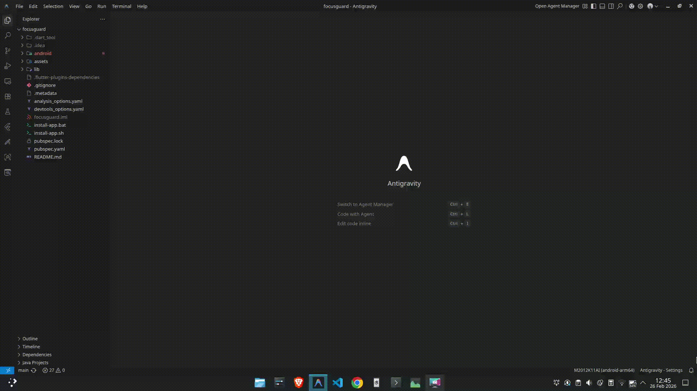

# FocusGuard — The Ultimate Focus Shield

<p align="center">
  
  
  
</p>

**"A premium, high-performance focus shield built with Flutter, featuring advanced app/web blocking and a sleek midnight aesthetic for deep productivity."**

FocusGuard is a sophisticated productivity tool designed to help you reclaim your time and achieve peak flow state. It combines robust system-level blocking with a stunning, glassmorphic UI.

---

## Visionary Features

### Elite App Blocking
System-level interruption of distracting applications. Select exactly which apps are off-limits during your deep work sessions with high-precision monitoring.

### Web & Domain Shield
Block specific websites across all major Android browsers. Maintain focus by eliminating web-based distractions at the DNS/browser level.

### Pro Focus Sessions
- **Deep Work Modes**: Configurable focus periods with real-time countdowns.
- **Session Presets**: Liquid-fast presets for 15, 25, 45, or 90-minute sprints.
- **Micro-Animations**: Experience a responsive UI that feels alive and rewarding.

### Analytics & Insights
- **Statistics Dashboard**: Weekly focus time visualization and daily trends using beautiful, interactive charts.
- **Session History**: Detailed logs of every focus sprint to track your long-term progress.
- **Usage Stats**: Data-driven insights into which apps attempt to steal your attention.

### Advanced Scheduling
Automate your productivity with recurring rules. Set your deep-work windows once and let FocusGuard handle the transition into focus mode automatically.

### Achievement System
Stay motivated by unlocking premium badges and hitting focus milestones. Turn your productivity journey into a rewarding progression system.

### Premium Midnight UI
- **Glassmorphism**: A state-of-the-art aesthetic using subtle transparencies and blurs.
- **Dark Mode Optimized**: Designed to reduce eye strain and look stunning on OLED displays.
- **Trusted Apps**: Whitelist essential tools (like Music or Notes) while keeping distractions locked away.

---

## One-Click Installation

We provide automated scripts that handle all the technical details, including ADB setup and architecture-specific selection.

### Windows, Linux, & macOS
Download the latest codebase and run our smart installers:

| Platform | Command | Key Features |
| :--- | :--- | :--- |
| **Linux/macOS** | `bash install-app.sh` | Auto-ADB detection, GitHub Release fetching, Architecture selection |
| **Windows** | `Double-click install-app.bat` | PowerShell-driven automation, Auto-download for Platform Tools |

---

### Direct Download (APK)
Prefer more control? Download the APK directly from our official portal:
**[thetwodigiter.app](https://www.thetwodigiter.app)**

---

## Bypassing "Play Protect" Guide

Since FocusGuard uses powerful **Accessibility Services** to monitor and block apps, Google Play Protect might flag the sideloaded APK. This is normal behavior for advanced system-level productivity tools.

**Watch the visual guide below for a seamless installation:**



> [IMPORTANT]
> FocusGuard values your privacy. The Accessibility Service is used **locally** on your device solely to detect when a blocked app is in the foreground. No usage data ever leaves your device.

---

## Architecture & Tech Stack

FocusGuard is engineered with scalability and performance in mind:

- **State Management**: [Riverpod](https://riverpod.dev) (Strict MVVM pattern)
- **Local Persistence**: [Hive](https://pub.dev/packages/hive) (High-performance NoSQL)
- **Navigation**: [GoRouter](https://pub.dev/packages/go_router) (Declarative routing)
- **Animations**: [Lottie](https://pub.dev/packages/lottie) & Flutter internal Animation controllers
- **Background Engine**: Custom Native Bridge (Kotlin) with Flutter Background Service

---

## Development

### Project Structure
```
focusguard/
├── lib/
│   ├── core/                # Routing, Theming, Widgets
│   ├── features/
│   │   ├── achievements/    # Gamification engine
│   │   ├── dashboard/       # Main control center
│   │   ├── focus_session/   # Real-time session logic
│   │   ├── scheduling/      # Recurrence engine
│   │   ├── statistics/      # Data visualization
│   │   └── website_blocking/# Web monitor
│   ├── services/            # Native bridges & background services
│   └── main.dart            # App entry
```

### Build for Production
```bash
flutter build apk --release
```

---

## Developer

Developed with passion by **thetwodigiter**. 

Check out more of my work and projects at my portfolio:
**[thetwodigiter.app](https://www.thetwodigiter.app)**

---

**Made with ❤️ to help you stay focused and achieve peak productivity.**
